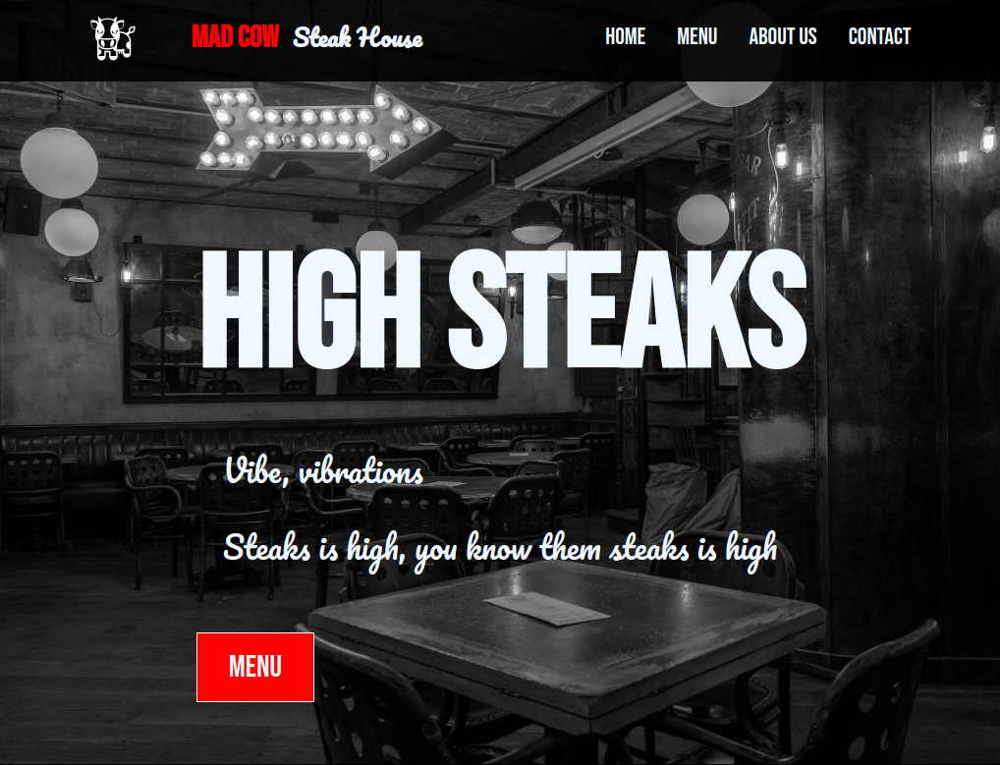

# restaurant-page

A restaurant page which renders dynamically using ES6 modules & Webpack (HTML, CSS & JS).

[Demo here](https://casssb.github.io/restaurant-page/)

## Thoughts

I feel like using ES6 modules is a huge upgrade in overall readability and makes separating code into modules feel so much better and more intuitive than just creating closures using IIFE's. I really like the overall concept of Webpack and using npm to install dependencies also feels much smoother and easier than having to download them directly like I've been doing before (setting up and using Sanitize took me around 3 seconds using npm and then importing it!). I think I've really began to appreciate the way that The Odin Project structures it's syllabus and is gradually easing us into using React. I'm already looking forward to being able to use JSX instead of manually creating nodes & content using vanilla JS!

## Possible Improvements
* I did consider making the mobile menu a column and have it operate more like a modal. I know this is the traditional way to do it and probably a slightly better user experience as it can give more space to click the option you need.
* As always the styles could be improved but since the purpose of this exercise was to get comfortable with Webpack I had to stop myself from being drawn into spending too long on CSS!
* I didn't end up using the Webpack HTML plugin (with a template) but think I'll do this in future since I did come across issues with the hashes changing when I updated an image.
* I have used innerHTML at times (although I've avoided using it where there is an opportunity to enter user data). Since I'm planning to use React in the long run this shouldn't matter.

## Credits
* De La Soul for [keeping it real](https://www.youtube.com/watch?v=tzOOCnkUlnA)
* Fluid CSS scaling defaults from [fluid-type-scale.com](https://www.fluid-type-scale.com/)
* Cow SVG from [svgrepo.com](https://www.svgrepo.com)
* Restaurant picture from [unsplash.com](https://unsplash.com/photos/yBNIf_ny6Ro)
* project idea from [The Odin Project](https://www.theodinproject.com/lessons/node-path-restaurant-page)
